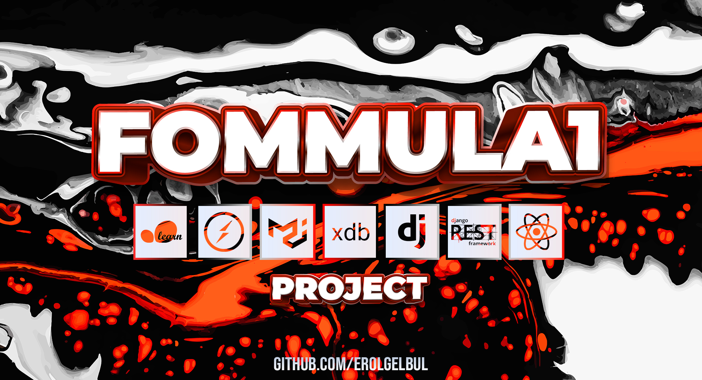
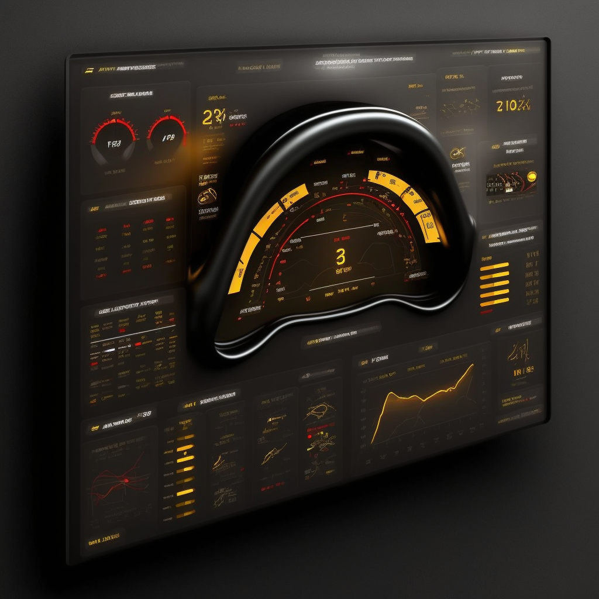

  

<!-- ABOUT THE PROJECT -->
## 1. Introduction

  

### 1.1 Legal Discloure

This project is for educational and demonstrative purposes only. It does not use
actual Formula 1 data, and any resemblance to real-world data or scenarios is
purely coincidental. The project is not affiliated with or endorsed by Formula
1, its teams, or any other associated entities.

The data used in this project is synthetic and has been generated for the sole
purpose of showcasing the capabilities of the web application and the machine
learning algorithms implemented. Users are advised that the insights and
recommendations provided by the application should not be considered as accurate
or reliable for any real-world application or decision-making.

By using this project, you acknowledge and agree that the creators and
maintainers of this project shall not be held liable for any direct or indirect
damages, losses, or consequences arising from the use or reliance on the
information provided by the application.

It is the responsibility of the user to ensure compliance with any applicable
laws, rules, and regulations when using or implementing the techniques,
algorithms, or ideas presented in this project. The creators and maintainers of
this project make no warranties or guarantees regarding the legality or
suitability of the project for any specific purpose or jurisdiction.

## 2. Stack

### 2.1 Backend

- Django
- Django Channels as the WebSockets library
- Django Rest Framework
- ExpressDB

### 2.2 Frontend

- React
- Material-UI for styling
- socket.io-client as the WebSockets library
- Axios

### ML

- Scikit-learn & PyTorch
    - Deep Q-Networks / Simulated Annealing
    - ARIMA
    - DBSCAN
    - Support Vector Machines
    - Nash Equilibrium & Behavioral Cloning
    - Isolation Forest & Autoencoders

## 3. Functionalities

<ins>Race strategy optimisation</ins>: algorithm to optimize pit stop
strategy, taking into account tire degradation, fuel consumption, track
conditions, and other relevant factors.

<ins>Driver performance analysis</ins>: driver performance to provide
personalized feedback on their drivign style to help improve lap times.

<ins>Car setup optimisation</ins>: optimize the car setup, such as suspension
settings, aerodynamics and engine mapping based on historical data and current
track conditions.

<ins>Opponent modelling</ins>: model the strategies and performance of other
teams and drivers.

<ins>Real-time anomaly detection</ins>: detect any unusual patterns or
mechanical issues in the car's telemetry data in real-time to prevent potential
failures.

## 4. Not Released Yet

### 4.1 Current Stage

Right now, I am building the "data source" for the project. Building something
that produces random data that makes sense takes some time, especially
generating random car speeds on a random track with randon turns and random
characteristics for a driver. Way too many random events... So for now, please
enjoy these interface ideas from
[Midjourney](https://www.midjourney.com/home/?callbackUrl=%2Fapp%2F).

  

 

  

 

  

 

  

 

  

 

  

<!-- CONTACT -->
## 5. Contact

Erol Gelbul - [Website](erolgelbul.com)

Project Link: [Fommula 1 Analysis](https://github.com/ErolGelbul/fommula_1_analysis)

(<a href="#top">back to top</a>)

